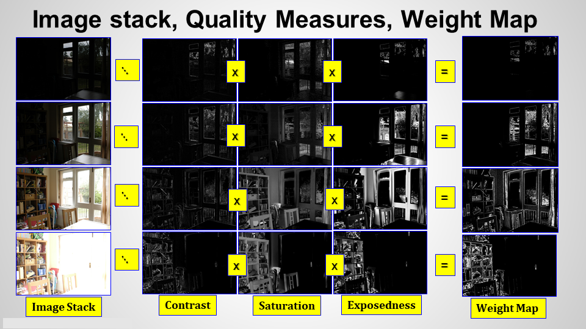
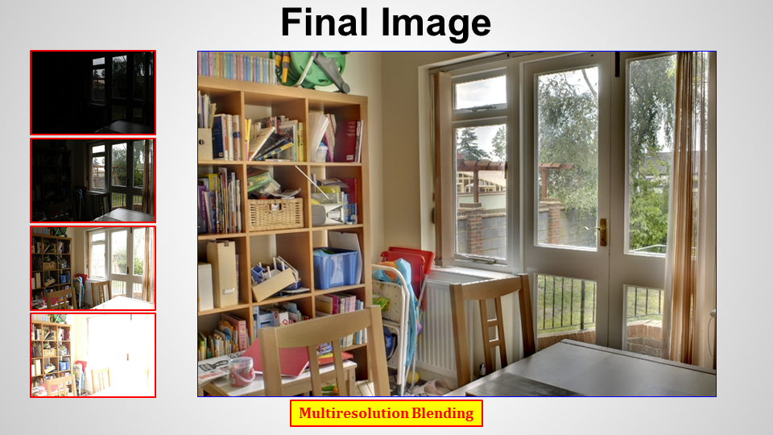
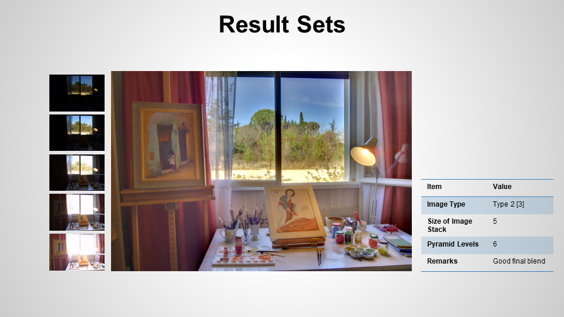
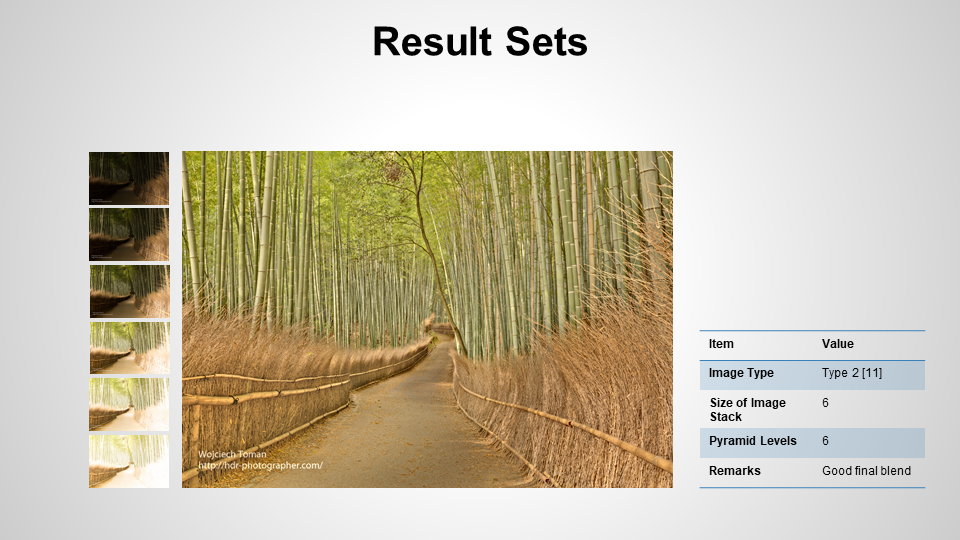
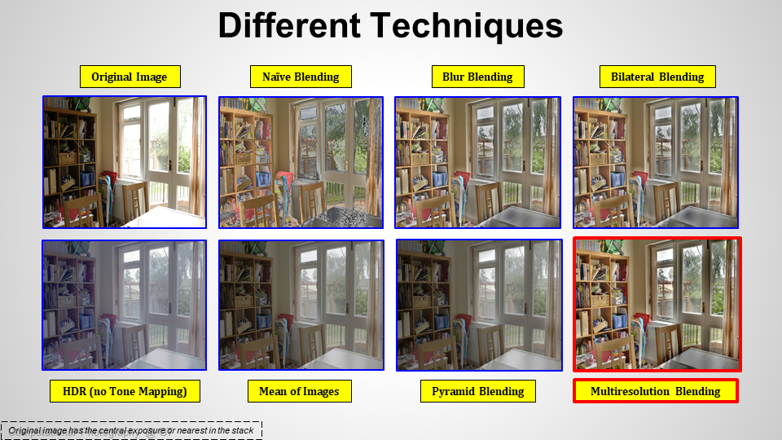

# Exposure Fusion

## Introduction
<p style="text-align: justify">
Exposure fusion is a technique that creates a single image with optimal detail from a set of multi-exposed images. As developed by Tom Mertens et al., the proposed algorithm computes relevant quality measures; Contrast, Saturation, and Well-Exposedness. These measures are then combined to create a weight map used to blend each of the multi-exposed images to a single image with best exposure. </p>

## Description
As developed by Tom Mertens [1], the exposure fusion algorithm computes relevant image quality measures; Contrast, Saturation, and Well-Exposedness.  These measures are then combined to create a weight-map used to blend each of the multi-exposed images to a single image with best exposure. The need for exposure fusion rises in finding optimal exposure settings during photography. Since this requires mastery of the exposure triangle which is difficult, requires a trade-off, and outright impractical for some scenes, techniques such as high dynamic ranging (HDR) and exposure fusion have been developed to obtain a desirable final image. Unlike HDR however, exposure fusion doesn’t require computation of a camera response curve or tone-mapping

```
Image stack: here, the multi-exposed images are combined into a stack of images to be processed
Quality measures: here, the (a) contrast, (b) saturation, and (c) well-exposedness are computed
Scalar Weight Map: here, the quality measures for Image[i] are combined and normalized
Blending: the weight maps and images are blended to obtain a final image  
Final Image: this is the final image with best detail using Multiresolution blending (Multires.)  
```

  

The image below shows the image stack, decomposed quality measures, and final weight maps.  
  


## Results
The images below shows outputs for different exposure-bracketed images.  
  
Another :  
 
Another :  
  
Another :  
  
 

A comparison with other methods:  



