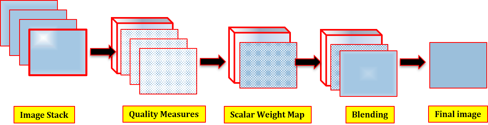

# Exposure Fusion

## Introduction

Exposure fusion is a technique that creates a single image with optimal detail from a set of multi-exposed images. As developed by Tom Mertens et al., the proposed algorithm computes relevant quality measures; Contrast, Saturation, and Well-Exposedness. These measures are then combined to create a weight map used to blend each of the multi-exposed images to a single image with best exposure. 

## Description
Image stack: here, the multi-exposed images are combined into a stack of images to be processed
Quality measures: here, the (a) contrast, (b) saturation, and (c) well-exposedness are computed
Scalar Weight Map: here, the quality measures for Image[i] are combined and normalized
Blending: the weight maps and images are blended to obtain a final image
Final Image: this is the final image with best detail using Multiresolution blending (Multires.) 

## Results

